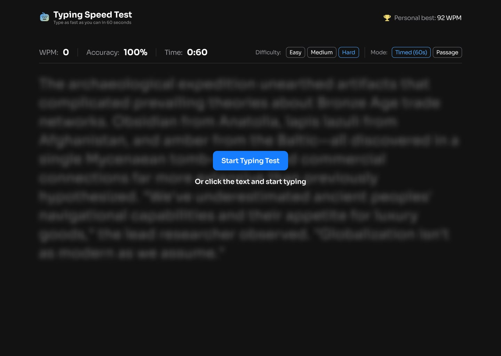

# Typing Speed Test

A responsive typing test built for the [Frontend Mentor Typing Speed Test challenge](https://www.frontendmentor.io/challenges/typing-speed-test). Choose a difficulty, race a 60-second timer or complete a full passage, and try to beat your personal best.



## Features

- Live words-per-minute (WPM), accuracy, and elapsed or remaining time
- Timed mode with a 60-second countdown
- Passage mode that runs until the full passage is complete
- Easy, medium, and hard passage difficulties
- Character-by-character correct and incorrect feedback
- Backspace support for correcting errors while preserving the total mistake count
- Result summaries with WPM, accuracy, and correct/incorrect characters
- Personal-best tracking with confetti for a new high score
- Persistent personal best, difficulty, and mode settings using `localStorage`
- Restart and replay flows for repeated practice
- Responsive layouts and controls for mobile and desktop screens
- Keyboard-accessible buttons, selects, and typing interactions

## Built with

- [Next.js 16](https://nextjs.org/) and the App Router
- [React 19](https://react.dev/) and [TypeScript](https://www.typescriptlang.org/)
- [React Aria Components](https://react-spectrum.adobe.com/react-aria/components.html) for accessible UI primitives
- CSS Modules, SCSS, CSS custom properties, Flexbox, Grid, and [Tailwind CSS](https://tailwindcss.com/)
- [canvas-confetti](https://www.npmjs.com/package/canvas-confetti) for personal-best celebrations
- [Jest](https://jestjs.io/) and [Testing Library](https://testing-library.com/) for test tooling
- [ESLint](https://eslint.org/) for static analysis

## Getting started

### Prerequisites

- Node.js `20.9+`
- npm

### Installation

```bash
git clone https://github.com/Zeeka32/typing-speed-website.git
cd typing-speed-website
npm install
npm run dev
```

Open [http://localhost:3000](http://localhost:3000) in your browser. No environment variables or external services are required because the typing passages are stored locally.

## Available scripts

| Command | Purpose |
| --- | --- |
| `npm run dev` | Start the Next.js development server |
| `npm run build` | Create a production build |
| `npm run start` | Run the production build locally |
| `npm run lint` | Run ESLint across the project |
| `npm test` | Run the Jest test suite |
| `npm run test:watch` | Run tests in watch mode |

## How it works

The selected difficulty determines which group of local passages is used. Passage mode chooses one random passage and counts upward until it is complete, while timed mode combines multiple random passages and counts down from 60 seconds. The interface compares each entered character with the target text and updates its visual state as the user types.

WPM uses the standard five-characters-per-word convention and the elapsed test time. Accuracy compares the accumulated mistakes with the total number of typed characters. React context and a reducer coordinate test status, input, timing, scores, and settings across the interface, while `localStorage` preserves the personal best and selected options between sessions.

## Project structure

```text
app/
├── layout.tsx              Root layout, metadata, and providers
├── page.tsx                Main test/results view
└── globals.css             Global styles and design tokens
components/
├── header/                 Branding and personal-best display
├── results/                Completion and score summary
├── typingTest/             Typing area, metrics, and test controls
└── ui/                     Reusable accessible UI components
shared/
└── context/
    ├── TestContext.tsx     Test state, reducer, and persistence
    └── testContext.test.ts Reducer and scoring tests
utils/
├── confetti.ts             New-personal-best celebration
├── data.json               Passages grouped by difficulty
└── utils.ts                Shared styling utilities
```

Static icons and decorative assets live in `public/assets`, while the supplied responsive design references live in `design`.

## Passage data

Typing content is stored in `utils/data.json` and grouped into `easy`, `medium`, and `hard` collections. Each entry contains a unique ID and the text displayed during a test, so the app does not need an API or network request to generate a session.

## Links

- [Live site](https://typing-speed-website-theta.vercel.app/)
- [Source code](https://github.com/Zeeka32/typing-speed-website)

## Author

- GitHub: [@Zeeka32](https://github.com/Zeeka32)
